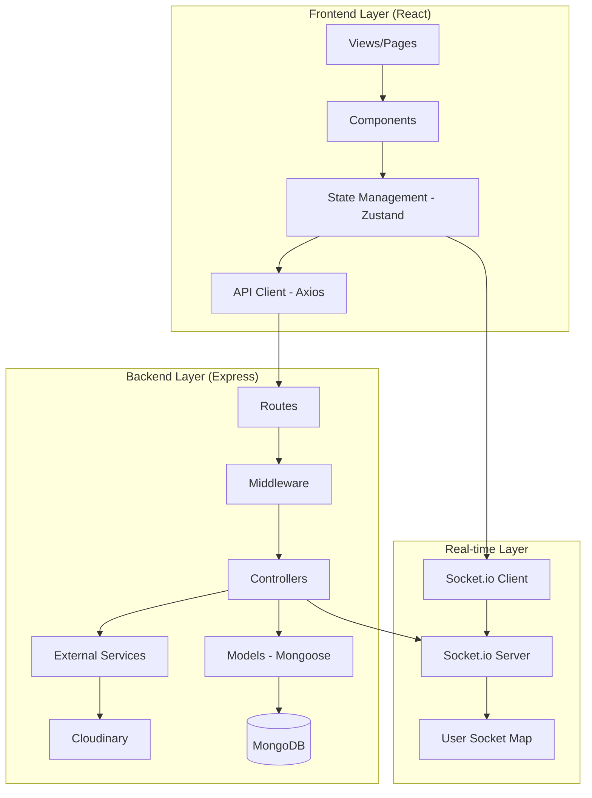

# Architecture Analysis Report

## Executive Summary

This document provides a comprehensive analysis of the fullstack-chat-app architecture, identifying the patterns used, violations of best practices, and recommendations for improving code cohesion and maintainability.

**Project Type**: Full-stack real-time chat application  
**Tech Stack**: MERN (MongoDB, Express.js, React, Node.js) + Socket.io  
**Analysis Date**: November 20, 2025

---

## Current Architecture Pattern

### Overall Pattern: **Modified MVC (Model-View-Controller)**

The application follows a layered architecture with clear separation between backend and frontend:



### Component Breakdown

#### Backend Architecture

**1. Models** ([models/](file:///c:/Users/shameer%20khan/Documents/fullstack-chat-app-master/samifiedchat/backend/src/models))
- `user.model.js` - User schema with authentication fields
- `message.model.js` - Message schema with sender/receiver relationships
- ✅ **Strength**: Clean schema definitions with proper relationships
- ⚠️ **Issue**: No validation at model level beyond basic type checking

**2. Controllers** ([controllers/](file:///c:/Users/shameer%20khan/Documents/fullstack-chat-app-master/samifiedchat/backend/src/controllers))
- `auth.controller.js` - Authentication logic (signup, login, logout, profile)
- `message.controller.js` - Messaging logic (send, retrieve, users list)
- ✅ **Strength**: Business logic separated from routing
- ❌ **Issue**: Controllers directly interact with models (no service layer)
- ❌ **Issue**: Controllers handle external API calls (Cloudinary)
- ❌ **Issue**: Mixed concerns (authentication + token generation)

**3. Routes** ([routes/](file:///c:/Users/shameer%20khan/Documents/fullstack-chat-app-master/samifiedchat/backend/src/routes))
- `auth.route.js` - Authentication endpoints
- `message.route.js` - Messaging endpoints
- ✅ **Strength**: Clean RESTful routing structure
- ⚠️ **Issue**: No input validation middleware

**4. Middleware** ([middleware/](file:///c:/Users/shameer%20khan/Documents/fullstack-chat-app-master/samifiedchat/backend/src/middleware))
- `auth.middleware.js` - JWT verification and route protection
- ✅ **Strength**: Proper authentication middleware
- ⚠️ **Issue**: Only one middleware file (missing validation, error handling)

**5. Library/Utilities** ([lib/](file:///c:/Users/shameer%20khan/Documents/fullstack-chat-app-master/samifiedchat/backend/src/lib))
- `db.js` - Database connection
- `socket.js` - Socket.io server setup
- `cloudinary.js` - Cloudinary configuration
- `utils.js` - JWT token generation
- ⚠️ **Issue**: Mixed abstraction levels (config vs utilities)

#### Frontend Architecture

**1. Pages** ([pages/](file:///c:/Users/shameer%20khan/Documents/fullstack-chat-app-master/samifiedchat/frontend/src/pages))
- Route-level components (HomePage, LoginPage, SignUpPage, etc.)
- ✅ **Strength**: Clear page-level organization

**2. Components** ([components/](file:///c:/Users/shameer%20khan/Documents/fullstack-chat-app-master/samifiedchat/frontend/src/components))
- Reusable UI components (Navbar, ChatContainer, Sidebar, etc.)
- ✅ **Strength**: Component reusability
- ⚠️ **Issue**: Some components may have too many responsibilities

**3. State Management** ([store/](file:///c:/Users/shameer%20khan/Documents/fullstack-chat-app-master/samifiedchat/frontend/src/store))
- `useAuthStore.js` - Authentication state
- `useChatStore.js` - Chat/messaging state
- `useThemeStore.js` - Theme preferences
- ✅ **Strength**: Zustand provides clean state management
- ✅ **Strength**: Well-separated concerns by domain

**4. API Layer** ([lib/axios.js](file:///c:/Users/shameer%20khan/Documents/fullstack-chat-app-master/samifiedchat/frontend/src/lib/axios.js))
- Centralized axios configuration
- ✅ **Strength**: Single source of API configuration

---

## Architecture Pattern Violations

### 1. **Missing Service Layer** ❌ CRITICAL

**Issue**: Controllers directly interact with models and external services.

**Example** ([auth.controller.js:97](file:///c:/Users/shameer%20khan/Documents/fullstack-chat-app-master/samifiedchat/backend/src/controllers/auth.controller.js#L97)):
```javascript
const uploadResponse = await cloudinary.uploader.upload(profilePic);
const updatedUser = await User.findByIdAndUpdate(
  userId,
  { profilePic: uploadResponse.secure_url },
  { new: true }
);
```

**Impact**: 
- Difficult to test controllers in isolation
- Business logic tightly coupled to data access
- Cannot reuse logic across different controllers

### 2. **No Repository Pattern** ❌ HIGH

**Issue**: Direct database queries scattered throughout controllers.

**Example** ([message.controller.js:24-29](file:///c:/Users/shameer%20khan/Documents/fullstack-chat-app-master/samifiedchat/backend/src/controllers/message.controller.js#L24-L29)):
```javascript
const messages = await Message.find({
  $or: [
    { senderId: myId, receiverId: userToChatId },
    { senderId: userToChatId, receiverId: myId },
  ],
});
```

**Impact**:
- Query logic cannot be reused
- Difficult to mock for testing
- Database concerns leak into business logic

### 3. **Inconsistent Error Handling** ⚠️ MEDIUM

**Issue**: Error handling is inconsistent across the application.

**Example** ([db.js:7-9](file:///c:/Users/shameer%20khan/Documents/fullstack-chat-app-master/samifiedchat/backend/src/lib/db.js#L7-L9)):
```javascript
catch (error) {
  console.log("MongoDB connection error:", error);
  // No process exit or retry logic
}
```

**Impact**:
- Application may continue running with failed database connection
- Errors not properly propagated
- Inconsistent error response formats

### 4. **Mixed Concerns in Entry Point** ⚠️ MEDIUM

**Issue**: [index.js](file:///c:/Users/shameer%20khan/Documents/fullstack-chat-app-master/samifiedchat/backend/src/index.js) handles server setup, routing, and static file serving.

**Impact**:
- Difficult to test individual components
- Server configuration not reusable
- Violates Single Responsibility Principle

### 5. **No Input Validation Layer** ❌ HIGH

**Issue**: No centralized input validation before controllers.

**Example** ([auth.controller.js:9-11](file:///c:/Users/shameer%20khan/Documents/fullstack-chat-app-master/samifiedchat/backend/src/controllers/auth.controller.js#L9-L11)):
```javascript
if (!fullName || !email || !password) {
  return res.status(400).json({ message: "All fields are required" });
}
```

**Impact**:
- Validation logic duplicated across controllers
- No type checking or sanitization
- Vulnerable to injection attacks

### 6. **Tight Coupling to External Services** ⚠️ MEDIUM

**Issue**: Cloudinary directly imported and used in controllers.

**Impact**:
- Cannot easily switch file storage providers
- Difficult to test without actual Cloudinary account
- Configuration scattered across files

### 7. **Global State in Socket.io** ⚠️ MEDIUM

**Issue**: [socket.js](file:///c:/Users/shameer%20khan/Documents/fullstack-chat-app-master/samifiedchat/backend/src/lib/socket.js) uses module-level `userSocketMap` object.

**Impact**:
- Not scalable to multiple server instances
- Memory leak potential
- Cannot persist across server restarts

---

## Cohesion Issues

### 1. **Low Cohesion in Controllers**

Controllers handle multiple responsibilities:
- Input validation
- Business logic
- Database operations
- External API calls
- Response formatting

**Recommendation**: Split into focused, single-purpose functions.

### 2. **Configuration Scattered**

Configuration appears in multiple places:
- Environment variables loaded in multiple files
- CORS configuration in [index.js](file:///c:/Users/shameer%20khan/Documents/fullstack-chat-app-master/samifiedchat/backend/src/index.js)
- Cloudinary config in [lib/cloudinary.js](file:///c:/Users/shameer%20khan/Documents/fullstack-chat-app-master/samifiedchat/backend/src/lib/cloudinary.js)
- Socket.io config in [lib/socket.js](file:///c:/Users/shameer%20khan/Documents/fullstack-chat-app-master/samifiedchat/backend/src/lib/socket.js)

**Recommendation**: Centralize all configuration in a single config module.

### 3. **Inconsistent Abstraction Levels**

The `lib/` directory mixes:
- Low-level utilities (utils.js)
- Configuration (cloudinary.js, db.js)
- Application setup (socket.js)

**Recommendation**: Reorganize into `config/`, `utils/`, and `services/` directories.

---

## Recommended Architecture Improvements

### 1. **Introduce Service Layer** 🎯 HIGH PRIORITY

Create service classes to encapsulate business logic:

```
backend/src/
├── services/
│   ├── auth.service.js       # Authentication business logic
│   ├── message.service.js    # Messaging business logic
│   ├── upload.service.js     # File upload abstraction
│   └── socket.service.js     # Socket.io operations
```

**Benefits**:
- Controllers become thin orchestrators
- Business logic reusable and testable
- Clear separation of concerns

### 2. **Implement Repository Pattern** 🎯 HIGH PRIORITY

Create repository classes for data access:

```
backend/src/
├── repositories/
│   ├── user.repository.js     # User data access
│   └── message.repository.js  # Message data access
```

**Benefits**:
- Database queries centralized
- Easy to mock for testing
- Can switch databases without changing business logic

### 3. **Add Validation Layer** 🎯 HIGH PRIORITY

Use express-validator or joi for input validation:

```
backend/src/
├── validators/
│   ├── auth.validator.js      # Authentication input validation
│   └── message.validator.js   # Message input validation
```

**Benefits**:
- Validation logic reusable
- Type safety and sanitization
- Prevents injection attacks

### 4. **Centralize Configuration** 🎯 MEDIUM PRIORITY

Create a unified configuration module:

```
backend/src/
├── config/
│   ├── index.js          # Main config export
│   ├── database.js       # Database configuration
│   ├── cloudinary.js     # Cloudinary configuration
│   ├── jwt.js            # JWT configuration
│   └── cors.js           # CORS configuration
```

### 5. **Add Error Handling Middleware** 🎯 MEDIUM PRIORITY

Create centralized error handling:

```
backend/src/
├── middleware/
│   ├── auth.middleware.js
│   ├── error.middleware.js      # Global error handler
│   └── validation.middleware.js  # Validation error handler
```

### 6. **Implement Dependency Injection** 🎯 LOW PRIORITY

Use a DI container (e.g., awilix) for better testability:

```javascript
// Example
class AuthController {
  constructor({ authService, uploadService }) {
    this.authService = authService;
    this.uploadService = uploadService;
  }
}
```

### 7. **Separate Socket.io Concerns** 🎯 MEDIUM PRIORITY

Create dedicated socket handlers:

```
backend/src/
├── sockets/
│   ├── index.js           # Socket.io setup
│   ├── handlers/
│   │   ├── connection.handler.js
│   │   └── message.handler.js
│   └── middleware/
│       └── auth.middleware.js  # Socket authentication
```

### 8. **Add API Versioning** 🎯 LOW PRIORITY

Prepare for future API changes:

```javascript
app.use('/api/v1/auth', authRoutes);
app.use('/api/v1/messages', messageRoutes);
```

---

## Proposed Directory Structure

### Backend (Improved)

```
backend/src/
├── config/              # Configuration files
│   ├── index.js
│   ├── database.js
│   ├── cloudinary.js
│   └── jwt.js
├── controllers/         # Request handlers (thin)
│   ├── auth.controller.js
│   └── message.controller.js
├── services/            # Business logic
│   ├── auth.service.js
│   ├── message.service.js
│   └── upload.service.js
├── repositories/        # Data access layer
│   ├── user.repository.js
│   └── message.repository.js
├── models/              # Mongoose schemas
│   ├── user.model.js
│   └── message.model.js
├── middleware/          # Express middleware
│   ├── auth.middleware.js
│   ├── error.middleware.js
│   └── validation.middleware.js
├── validators/          # Input validation schemas
│   ├── auth.validator.js
│   └── message.validator.js
├── routes/              # API routes
│   ├── index.js
│   ├── auth.route.js
│   └── message.route.js
├── sockets/             # Socket.io handlers
│   ├── index.js
│   └── handlers/
├── utils/               # Utility functions
│   ├── logger.js
│   └── response.js
└── index.js             # Application entry point
```

---

## Migration Strategy

### Phase 1: Add Validation Layer (Week 1)
1. Install express-validator
2. Create validator files
3. Add validation middleware to routes
4. Test all endpoints

### Phase 2: Introduce Service Layer (Week 2)
1. Create service files
2. Move business logic from controllers to services
3. Update controllers to use services
4. Add unit tests for services

### Phase 3: Implement Repository Pattern (Week 2-3)
1. Create repository files
2. Move database queries to repositories
3. Update services to use repositories
4. Add integration tests

### Phase 4: Centralize Configuration (Week 3)
1. Create config directory
2. Move all configuration to config files
3. Update imports across application
4. Add environment validation

### Phase 5: Improve Error Handling (Week 4)
1. Create error handling middleware
2. Define custom error classes
3. Update all error responses
4. Add error logging

---

## Conclusion

The current architecture follows a **modified MVC pattern** with good separation between frontend and backend. However, it lacks several important layers that would improve maintainability, testability, and scalability.

**Key Strengths**:
- ✅ Clear separation between frontend and backend
- ✅ RESTful API design
- ✅ Proper use of middleware for authentication
- ✅ Clean state management with Zustand

**Critical Improvements Needed**:
- ❌ Add service layer for business logic
- ❌ Implement repository pattern for data access
- ❌ Add comprehensive input validation
- ⚠️ Centralize configuration
- ⚠️ Improve error handling consistency

**Overall Assessment**: The architecture is functional but needs refactoring to follow SOLID principles and improve separation of concerns. The recommended improvements would make the codebase more maintainable, testable, and scalable.
